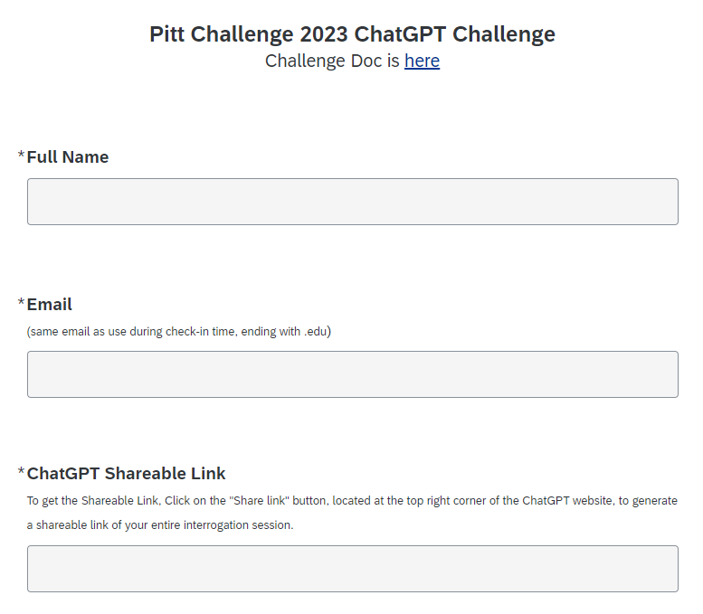
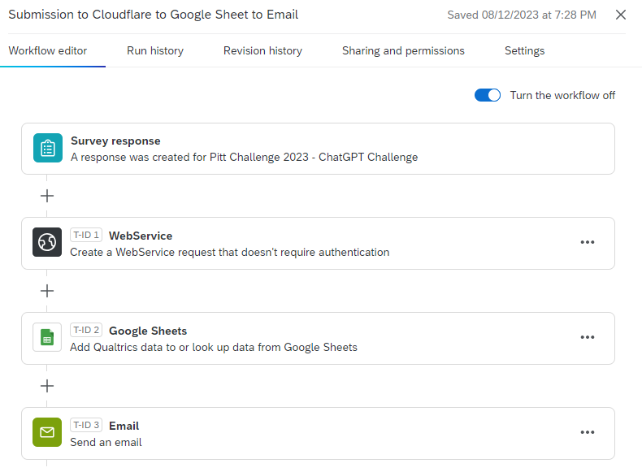
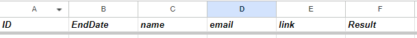

# ChatGPT Adversarial Attack for The Pitt Challenge 2023

## Introduction

The details about the challenge can be found [here](ChatGPT_Adversarial_Attack_Challenge.pdf).

## Architecture

Qualtrics Form --> Cloudflare Worker --> Google Sheet --> Email

- Qualtrics Form: The form that participants will fill out.
- Cloudflare Worker: Check if the response is valid or invalid.
- Google Sheet: Store the all the responses.
- Email: Send the email to the participants about the result.

Other options to achieve the same goal:

- Microsoft Flow + Cloudflare Worker + Google Sheet
- Firebase + Microsoft Flow
- AWS Lambda

## Qualtrics Form

## Qualtrics Workflow

## Google Sheet

